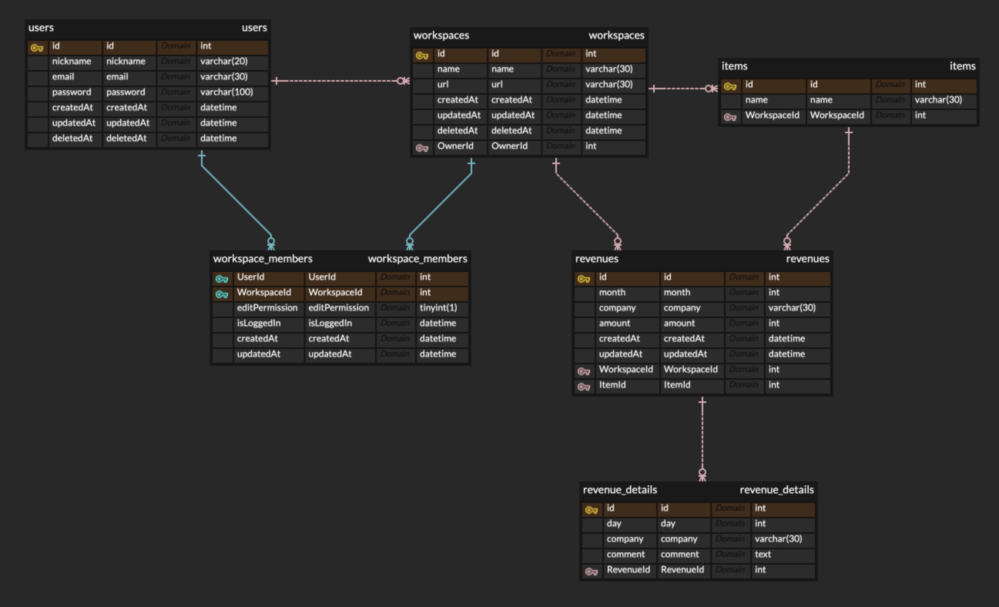

# API
## user
### 회원가입
```bash
POST /user
body: { nickname: string, email: string, password: string }
return '회원가입 성공';
```
### 내 정보 조회 
```bash
GET /user/info
body: {}
return User;
```
### 내 정보 수정
```bash
PATCH /user/info
body: { nickname: string, email: string, password: string, newPassword: string }
return '내 정보 수정 성공';
```
### 사용자 정보 조회
```bash
GET /user/info/:id
body: {}
return User;
```
### 로그인
```bash
POST /login
body: { email: string, password: string }
return User;
```
### 로그아웃
```bash
POST /logout
body: {}
return 'ok';
```
### 회원탈퇴
```bash
DELETE /user
body: {}
return 'ok';
```
---
### workspace 목록 조회
```bash
GET /workspaces
body: {}
return Workspace[]
```
### workspace 생성
```bash
POST /workspace
body: { name: string, url: string }
return "Workspace 생성 성공"
```
### workspace 수정
```bash
PATCH /workspace/:id
body: { name: string, url: string }
return "Workspace 수정 성공"
```
### workspace 삭제
```bash
DELETE /workspace/:id
body: {}
return "Workspace 삭제 성공"
```
---
### workspace Member 목록 조회
```bash
GET /workspaces/:workspace
body: {}
return User[]
```
### workspace Member 추가
```bash
POST /workspaces/:workspace
body: { email: string }
return 'Member 추가 성공'
```
### workspace Member 삭제
```bash
DELETE /workspaces/:workspace/members/:id
body: {}
return 'Member 삭제 성공'
```
### workspace Member 수정권한 변경
```bash
POST /workspaces/:workspace/members/:id
body: {}
return 'Member 수정권한 변경 완료'
```
---
### 매출 목록 조회
```bash
GET /workspaces/:workspace/revenues
body: {}
return Revenue[];
```
### 매출 조회
```bash
GET /workspaces/:workspace/revenue/:id
body: {}
return Revenue;
```
### 매출 추가
```bash
POST /workspaces/:workspace/revenue/
body: { month: number, company: string, amount: number, day?: number, comment?: string, ItemId: Item }
return 'ok';
```
### 매출 수정
```bash
PATCH /workspaces/:workspace/revenue/:id
body: { month: number, company: string, amount: number, day?: number, comment?: string, ItemId: Item }
return 'ok';
```
### 매출 삭제
```bash
DELETE /workspaces/:workspace/revenue/:id
body: {}
return 'ok';
```
---
### 항목 조회
```bash
GET /workspaces/:workspace/items
body: {}
return Item[];
```
### 항목 추가
```bash
POST /workspaces/:workspace/item
body: { name: string }
return 'ok;
```
### 항목 수정
```bash
GET /workspaces/:workspace/item/:id
body: { name: string }
return 'ok';
```
### 항목 삭제
```bash
GET /workspaces/:workspace/item/:id
body: {}
return 'ok';
```


## ERD

* 매출 상세에 회사가 있는 건 오류임